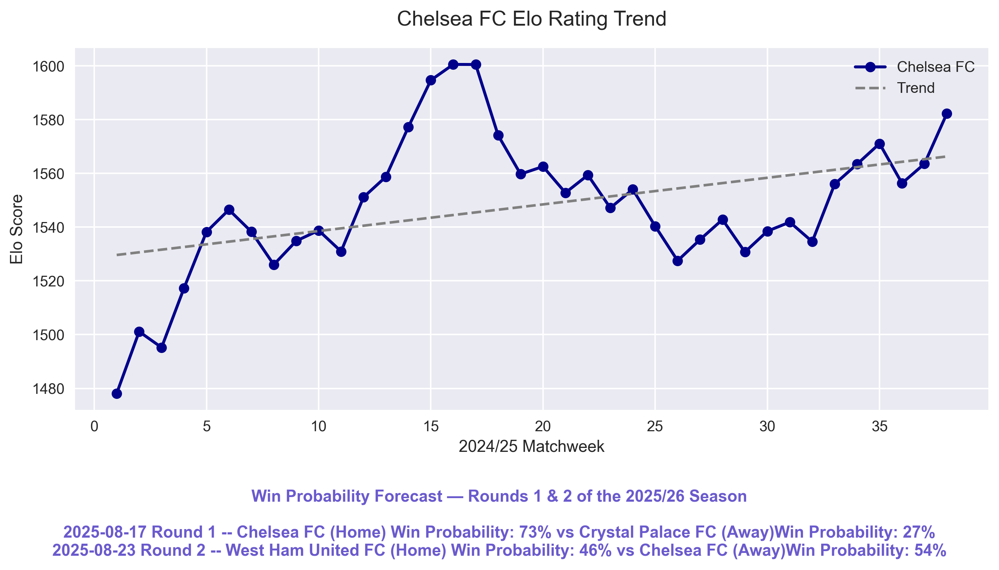

# EPL Metrics Lab ⚽📊
**This project analyzes the 2024/25 English Premier League season, using Elo rating and custom logic to evaluate teams and players. It also predicts win probabilities for the first two rounds of the 2025/26 season. Built in Python, it handles full-cycle data analysis, modeling, and visualization, producing charts and CSV outputs.**


## ✨ Key Features

- 📈 **Elo Rating Engine**  
  Customized Elo system designed specifically for football, incorporating home advantage and dynamic team updates based on match outcomes.

- 📍 **Match Forecasting**  
  Estimates win probabilities for the first two rounds of the 2025/26 season using a simplified Elo-based model (no Elo updates involved).

- 📊 **Player Ranking Model**  
  Ranks 2024/25 Premier League players using position-specific scoring models. The Top 3 performers are selected per role (forwards, midfielders, defenders), based on a multi-metric efficiency analysis that highlights both star players and underrated high-impact contributors.

- 📎 **Visualization**  
  Automatically generates Elo rating trend lines and radar charts for the top 3 players per position.

- 🧠 **Modular Architecture**  
  Cleanly structured, object-oriented codebase with shared abstractions, enabling easy maintenance, scaling, and feature extension.

- ⚙️ **One-Click Execution**  
  Run `main.py` to execute the entire pipeline and generate all analytical outputs and visualizations automatically.


## 🧰 Methodology Highlights

- **Playing Time Filter for Fair Comparison**  
  Only players whose playing time exceeds the median among their position group are included in the ranking. The filter prevents short-appearance players from skewing the results with artificially inflated per-90 metrics.

- **Normalized, Weighted Evaluation**  
  Each selected metric is scaled and aggregated using a weighted formula specific to each position (FW, MF, DF). Final scores are computed from multiple dimensions using hand-tuned weights to reflect role-specific expectations.

- **LLM-Assisted Scoring Model**  
  The player ranking logic is built on a scoring system designed by ChatGPT, simulating the reasoning of a Premier League coach. It evaluates players across multiple dimensions—attacking, defending, progression, and chance creation—focusing on per-90-minute efficiency and excluding bias from fame or media attention.

- **Outlier-Aware Scaling Strategy**  
  For each feature, the system applies outlier detection using the interquartile range (IQR). If any values fall outside the typical range (below Q1 − 1.5 × IQR or above Q3 + 1.5 × IQR), a log transformation (`log1p`) is applied before normalization to reduce skewness. Otherwise, standard min-max normalization is used. This hybrid approach ensures robustness and comparability even in the presence of extreme values.

- **Abstract Class for Role-Based Scoring**  
  A shared abstract base class defines the interface for all player scoring logic. Three dedicated subclasses implement position-specific evaluation strategies, ensuring modularity and extensibility.

- **Elo + Win Rate Forecasting**  
For team analysis, the system utilizes traditional Elo rating updates for historical matches and a win-rate-based model (the first step of Elo) to forecast outcomes for upcoming fixtures, eliminating the need for fresh match data.

- **Manual Data Processing from FBref**  
  Due to failed attempts at web scraping, player data was manually collected via copy and paste and rigorously cleaned using Python. Processing steps included standardizing field names, resolving conflicts, deduplicating records, unifying position labels, and ensuring schema consistency for accurate analysis.

## ⚠️ Assumptions and Limitations

This analysis is based entirely on data from the 2024/25 Premier League season and does **not** account for player transfers, managerial changes, or tactical shifts occurring during the 2025 summer off-season.

## 🛠 Tech Stack

- **Language**: Python 3.11
- **Data Processing**: pandas, numpy
- **Visualization**: matplotlib
- **Programming Paradigm**: OOP (abstract base class and subclasses)
- **IDE**: PyCharm
- **Version Control**: Git + GitHub

## 🗂️ Project Structure

```
epl_metrics_lab/
│
├── data/                      # Pre-cleaned input CSV files
│   ├── elo_matches_2425.csv
│   ├── epl_2025_schedule.csv
│   └── merged_players_all.csv
│
├── outputs/                   # Automatically generated outputs after running main.py
│   ├── elo_history_all.csv
│   ├── all_[pos]_players.csv
│   ├── win_probability_forecast.csv
│   ├── [team_name]_elo_trend.png
│   └── radar_[position].png
│
├── config.py             # Global constants (e.g., ELO base, styling)
├── utils.py              # Elo calculation logic, probability functions
├── team_analyzer.py      # Team-level performance analysis and forecasting
├── player_analyzer.py    # Player scoring and ranking
├── plotters.py           # Plot functions (Elo trend, radar charts)
├── main.py               # Main script: end-to-end pipeline
├── requirements.txt
├── LICENSE
└── README.md
```

## 📂 Output Samples

After running `main.py`, an `outputs/` folder will be created containing analysis results based on your selections.

Possible outputs include:

- `elo_history_all.csv` — Elo ratings for all teams throughout the 2024/25 season  
- `all_[pos]_players.csv` — Full ranking of all eligible players in each selected position  
- `win_probability_forecast.csv` — Forecasted win probabilities for early rounds of the 2025/26 season  

Optional visualizations (PNG format) may also be generated, depending on your choices:

- Elo rating trend chart and win forecast for selected team(s)  
- Radar charts for the top 3 players in selected position(s)

### 🖼️ Sample Visualizations

#### 📈 Elo Trends (2024/25) & Win Forecasts (2025/26)

#### 🧠 Top Forward Radar Chart

#### 🧾 Forward Rankings Table


## 🚀 How to Run

1. **Clone this repository**  
   ```bash
   git clone https://github.com/ericzone88/epl-metrics-lab.git
   ```

2. **Install dependencies**  
   Make sure you have **Python 3.10+** installed. Then install required packages:  
   ```bash
   pip install -r requirements.txt
   ```

3. **Run the project**  
   ```bash
   python main.py
   ```

## 🧪 Unit Testing
Run tests from the project root:
```bash
PYTHONPATH=. pytest

## 👤 Author

Lewang Zhang (ericzone88)

This project was independently designed and developed during my 60-day self-learning journey in Python. 

It combines technical skills with a personal interest in football, serving as part of my undergraduate application portfolio for Computer Science and Financial Technology programs.  

I welcome feedback or suggestions from the open-source community.